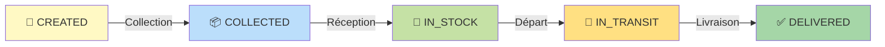
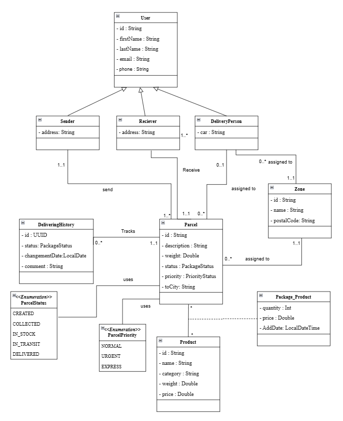

<div align="center">

# 🚚 SmartLogi - Système de Gestion de Livraison

<p align="center">
  
  
  
  
</p>

<p align="center">
  
  
  
</p>

### 📦 Système Complet de Gestion des Livraisons de Colis

*Un système professionnel de bout en bout pour gérer les opérations de livraison, construit avec Spring Boot et les meilleures pratiques architecturales.*

[Documentation API](http://localhost:8080/swagger-ui.html) • [Installation](#-installation) • [Guide de Test](TestGuide.md) • [UML](#-architecture--diagramme-uml)

</div>

---

## 📋 Table des Matières

- [🎯 Vue d'Ensemble](#-vue-densemble)
- [✨ Fonctionnalités](#-fonctionnalités)
- [🛠️ Stack Technologique](#️-stack-technologique)
- [🏗️ Architecture & Diagramme UML](#️-architecture--diagramme-uml)
- [⚡ Démarrage Rapide](#-démarrage-rapide)
- [📦 Installation Complète](#-installation-complète)
- [📚 Documentation API](#-documentation-api)
- [📁 Structure du Projet](#-structure-du-projet)
- [🤝 Contribution](#-contribution)

---

## 🎯 Vue d'Ensemble

**SmartLogi** est une solution complète de gestion de livraison de colis développée avec Spring Boot. Le système couvre l'ensemble du cycle de vie des livraisons, de la création du colis à la livraison finale, avec suivi en temps réel et notifications automatiques.

### 🎪 Que fait le système ?

<table>
  <tr>
    <td align="center" width="25%">
      <br/>
      <b>Gestion des Colis</b><br/>
      <sub>Création, suivi et gestion complète du cycle de vie</sub>
    </td>
    <td align="center" width="25%">
      <br/>
      <b>Clients & Destinataires</b><br/>
      <sub>Base de données clients et destinataires</sub>
    </td>
    <td align="center" width="25%">
      <br/>
      <b>Gestion des Livreurs</b><br/>
      <sub>Personnel de livraison et assignation</sub>
    </td>
    <td align="center" width="25%">
      <br/>
      <b>Zones Géographiques</b><br/>
      <sub>Organisation par zones de livraison</sub>
    </td>
  </tr>
  <tr>
    <td align="center" width="25%">
      <br/>
      <b>Notifications Email</b><br/>
      <sub>Alertes automatiques de statut</sub>
    </td>
    <td align="center" width="25%">
      <br/>
      <b>Catalogue Produits</b><br/>
      <sub>Gestion de l'inventaire</sub>
    </td>
    <td align="center" width="25%">
      <br/>
      <b>Analytiques</b><br/>
      <sub>Statistiques et rapports</sub>
    </td>
    <td align="center" width="25%">
      <br/>
      <b>Historique</b><br/>
      <sub>Traçabilité complète</sub>
    </td>
  </tr>
</table>

### 🎯 Cycle de Vie d'un Colis



---

## ✨ Fonctionnalités

### 🎯 Fonctionnalités Principales

<table>
  <tr>
    <td width="50%">

#### 📦 Gestion Complète des Colis
- ✅ Création de colis multi-produits
- ✅ Suivi de statut en temps réel
- ✅ 3 niveaux de priorité (NORMAL, URGENT, EXPRESS)
- ✅ Assignation automatique livreur/zone
- ✅ Historique complet des changements
- ✅ Recherche et filtrage avancés
- ✅ Calcul automatique de la valeur totale

#### 👥 Gestion des Parties Prenantes
- ✅ Clients expéditeurs (email unique)
- ✅ Destinataires (email optionnel)
- ✅ Personnel de livraison
- ✅ Recherche par nom, email, téléphone
- ✅ Suivi des colis par client

    </td>
    <td width="50%">

#### 📧 Notifications Intelligentes
- ✅ Confirmation de création de colis
- ✅ Alertes de changement de statut
- ✅ Confirmation de livraison
- ✅ Templates HTML professionnels
- ✅ Couleurs selon statut/priorité

#### 📊 Analytiques & Rapports
- ✅ Statistiques en temps réel
- ✅ Colis haute priorité non livrés
- ✅ Colis non assignés
- ✅ Performance des livreurs
- ✅ Revenus par produit
- ✅ Groupement par statut/zone/priorité

    </td>
  </tr>
</table>

---

## 🛠️ Stack Technologique

### Backend Framework

<p align="left">
  
  
  
  
</p>

### Base de Données & Migrations

<p align="left">
  
  
</p>

### Documentation & API

<p align="left">
  
  
  
</p>

### Mapping & Utilitaires

<p align="left">
  
  
  
  
</p>


### Build & DevOps

<p align="left">
  
  
</p>

---

## 🏗️ Architecture & Diagramme UML

### Architecture en Couches

```
┌──────────────────────────────────────────────────────────┐
│                    CLIENT LAYER                          │
│        (Browser, Mobile App, Postman, etc.)             │
└──────────────────────────────────────────────────────────┘
                           ↓ HTTP/REST
┌──────────────────────────────────────────────────────────┐
│               PRESENTATION LAYER                         │
│     REST Controllers + OpenAPI/Swagger UI                │
│  • 8 Controllers  • 80+ Endpoints  • Full CRUD          │
└──────────────────────────────────────────────────────────┘
                           ↓
┌──────────────────────────────────────────────────────────┐
│                  SERVICE LAYER                           │
│     Business Logic + Transaction Management              │
│  • 8 Services  • Email Service  • Validation            │
└──────────────────────────────────────────────────────────┘
                           ↓
┌──────────────────────────────────────────────────────────┐
│                 PERSISTENCE LAYER                        │
│          Spring Data JPA Repositories                    │
│  • 8 Repositories  • 138+ Custom Queries                │
└──────────────────────────────────────────────────────────┘
                           ↓
┌──────────────────────────────────────────────────────────┐
│                  DATABASE LAYER                          │
│               PostgreSQL Database                        │
│  • 8 Tables  • Managed by Liquibase                     │
└──────────────────────────────────────────────────────────┘
```

### 📐 Diagramme de Classes UML

Le diagramme ci-dessous illustre le modèle de domaine complet du système SmartLogi, montrant toutes les entités, leurs relations et cardinalités.

<div align="center">
  
  <br/>
  <sub><i>Diagramme de classes UML - Modèle de domaine SmartLogi</i></sub>
</div>

#### 🔑 Entités Principales

- **Parcel** : Entité centrale connectant tous les autres composants
- **SenderClient** : Clients expéditeurs (entreprises/particuliers)
- **Recipient** : Destinataires des colis
- **DeliveryPerson** : Personnel de livraison
- **Zone** : Zones géographiques de livraison
- **Product** : Catalogue des produits
- **ParcelProduct** : Table de jonction avec attributs (quantité, prix)
- **DeliveryHistory** : Historique immuable des changements de statut


### 🎨 Design Patterns Utilisés

| Pattern | Usage | Bénéfices |
|---------|-------|-----------|
| **MVC** | Architecture globale | Séparation des responsabilités |
| **DTO Pattern** | Transfert de données | Découplage entités/API |
| **Repository** | Accès aux données | Abstraction de la persistance |
| **Service Layer** | Logique métier | Réutilisation et testabilité |
| **Dependency Injection** | Gestion des dépendances | Couplage faible |
| **Builder Pattern** | Construction d'objets | Objets complexes lisibles |

---

## ⚡ Démarrage Rapide

### Prérequis

```bash
☑️ Java 17+
☑️ Maven 3.6+
☑️ PostgreSQL 16+
☑️ Git (optionnel)
```

### 🚀 Lancement en 3 Étapes

```bash
# 1️⃣ Créer la base de données
psql -U postgres
CREATE DATABASE Logismart;
\q

# 2️⃣ Cloner et compiler
git clone https://github.com/votre-username/LogismartV2.git
cd LogismartV2
mvn clean install -DskipTests

# 3️⃣ Configurer et lancer
# Éditer src/main/resources/application.yml avec vos credentials
mvn spring-boot:run
```

### ✅ Vérification

Ouvrir dans votre navigateur :
```
http://localhost:8080/swagger-ui.html
```

Vous devriez voir l'interface Swagger avec tous les endpoints ! 🎉

---

## 📦 Installation Complète

### Étape 1 : Configuration Base de Données

```bash
# Se connecter à PostgreSQL
psql -U postgres

# Créer la base de données
CREATE DATABASE Logismart;

# Créer un utilisateur dédié (recommandé)
CREATE USER logismart_user WITH PASSWORD 'votre_mot_de_passe_fort';
GRANT ALL PRIVILEGES ON DATABASE logismart_db TO logismart_user;

# Quitter
\q
```

### Étape 2 : Configuration Application

Éditer `src/main/resources/application.yml` :

```yaml
spring:
  datasource:
    url: jdbc:postgresql://localhost:5432/Logismart
    username: logismart_user          # ← Votre utilisateur
    password: votre_mot_de_passe_fort # ← Votre mot de passe
    driver-class-name: org.postgresql.Driver

  jpa:
    hibernate:
      ddl-auto: none  # Liquibase gère le schéma
    show-sql: true
    properties:
      hibernate:
        format_sql: true
        dialect: org.hibernate.dialect.PostgreSQLDialect

  liquibase:
    enabled: true
    change-log: classpath:db/changelog/db.changelog-master.xml

  mail:
    host: smtp.gmail.com
    port: 587
    username: votre-email@gmail.com    # ← Pour notifications email (optionnel)
    password: votre-app-password       # ← Mot de passe application Gmail
    properties:
      mail:
        smtp:
          auth: true
          starttls:
            enable: true
```

### Étape 3 : Compilation et Exécution

```bash
# Nettoyer et compiler
mvn clean install

# Ou passer les tests pour aller plus vite
mvn clean install -DskipTests

# Lancer l'application
mvn spring-boot:run
```

### Étape 4 : Accéder à l'Application

| Service | URL | Description |
|---------|-----|-------------|
| **API REST** | `http://localhost:8080/api/` | Endpoints REST |
| **Swagger UI** | `http://localhost:8080/swagger-ui.html` | Documentation interactive |
---

## 📚 Documentation API

### 🎯 Swagger UI - Documentation Interactive

<div align="center">
  
  <br/>
  <b>URL:</b> <code>http://localhost:8080/swagger-ui.html</code>
</div>

L'interface Swagger fournit :
- 📖 Documentation complète de tous les endpoints
- 🧪 Tests interactifs en un clic
- 📝 Exemples de requêtes et réponses
- ✅ Règles de validation détaillées
- 🔍 Recherche et filtrage
- 📊 Schémas de données

### 📌 Endpoints Principaux

<table>
  <tr>
    <th>Module</th>
    <th>Endpoint</th>
    <th>Méthodes</th>
    <th>Description</th>
  </tr>
  <tr>
    <td>🗺️ <b>Zones</b></td>
    <td><code>/api/zones</code></td>
    <td>GET, POST, PUT, DELETE</td>
    <td>Gestion des zones géographiques</td>
  </tr>
  <tr>
    <td>👤 <b>Clients</b></td>
    <td><code>/api/sender-clients</code></td>
    <td>GET, POST, PUT, DELETE</td>
    <td>Gestion clients expéditeurs</td>
  </tr>
  <tr>
    <td>📬 <b>Destinataires</b></td>
    <td><code>/api/recipients</code></td>
    <td>GET, POST, PUT, DELETE</td>
    <td>Gestion destinataires</td>
  </tr>
  <tr>
    <td>📦 <b>Produits</b></td>
    <td><code>/api/products</code></td>
    <td>GET, POST, PUT, DELETE</td>
    <td>Catalogue produits</td>
  </tr>
  <tr>
    <td>🚚 <b>Livreurs</b></td>
    <td><code>/api/delivery-persons</code></td>
    <td>GET, POST, PUT, DELETE</td>
    <td>Personnel de livraison</td>
  </tr>
  <tr>
    <td>📦 <b>Colis</b></td>
    <td><code>/api/parcels</code></td>
    <td>GET, POST, PUT, DELETE</td>
    <td>Gestion complète des colis</td>
  </tr>
  <tr>
    <td>📜 <b>Historique</b></td>
    <td><code>/api/delivery-history</code></td>
    <td>GET, POST, DELETE</td>
    <td>Historique des livraisons</td>
  </tr>
  <tr>
    <td>📊 <b>Statistiques</b></td>
    <td><code>/api/statistics</code></td>
    <td>GET</td>
    <td>Analytiques et rapports</td>
  </tr>
</table>

### 💡 Exemples d'Utilisation

<details>
<summary><b>📦 Créer un Colis</b></summary>

```bash
POST http://localhost:8080/api/parcels
Content-Type: application/json

{
  "description": "Commande urgente - Laptop Dell",
  "weight": 2.8,
  "priority": "URGENT",
  "destinationCity": "Casablanca",
  "senderClientId": "uuid-sender",
  "recipientId": "uuid-recipient",
  "products": [
    {
      "productId": "uuid-product",
      "quantity": 1,
      "price": 15000.00
    }
  ]
}
```

**Réponse 201 Created:**
```json
{
  "id": "uuid-parcel",
  "description": "Commande urgente - Laptop Dell",
  "status": "CREATED",
  "priority": "URGENT",
  "totalValue": 15000.00,
  "createdAt": "2025-11-09T10:30:00"
}
```

</details>

<details>
<summary><b>🔄 Mettre à Jour le Statut</b></summary>

```bash
PUT http://localhost:8080/api/parcels/uuid-parcel
Content-Type: application/json

{
  "id": "uuid-parcel",
  "status": "IN_TRANSIT",
  "deliveryPersonId": "uuid-delivery-person",
  "zoneId": "uuid-zone"
}
```

</details>

<details>
<summary><b>🔍 Recherche Avancée</b></summary>

```bash
GET http://localhost:8080/api/parcels/search?status=IN_TRANSIT&priority=URGENT&page=0&size=10&sort=createdAt,desc
```

</details>

---

### 📝 Documentation Complète

Consultez  [TestGuide.md](TestGuide.md) pour :
- Guide de test par User Stories
- Documentation détaillée de chaque test
- Scénarios de test complets
- Données de test

---

## 📁 Structure du Projet

```
LogismartV2/
├── 📂 src/
│   ├── 📂 main/
│   │   ├── 📂 java/com/logismart/logismartv2/
│   │   │   ├── 📂 config/           # Configuration Spring
│   │   │   ├── 📂 controller/       # REST Controllers (8)
│   │   │   ├── 📂 dto/              # Data Transfer Objects (24)
│   │   │   │   ├── parcel/          # DTOs Colis
│   │   │   │   ├── product/         # DTOs Produits
│   │   │   │   ├── senderclient/    # DTOs Clients
│   │   │   │   └── ...
│   │   │   ├── 📂 entity/           # Entités JPA (8 + 2 enums)
│   │   │   ├── 📂 exception/        # Gestion des exceptions
│   │   │   ├── 📂 mapper/           # Mappers MapStruct (8)
│   │   │   ├── 📂 repository/       # Repositories Spring Data (8)
│   │   │   └── 📂 service/          # Services métier (8)
│   │   └── 📂 resources/
│   │       ├── 📄 application.yml   # Configuration principale
│   │       └── 📂 db/
│   │           └── 📂 changelog/    # Migrations Liquibase
│   └── 📂 test/                     # Tests (6 classes, 73+ tests)
├── 📂 UML/
│   └── 📄 LogismartV2.png          # Diagramme de classes UML
├── 📄 pom.xml                       # Configuration Maven
├── 📄 README.md                     # Ce fichier
├── 📄 ROADMAP.md                    # Feuille de route détaillée
└── 📄 GUIDE_TEST_API_PAR_USER_STORIES.md  # Guide de test

```

---

