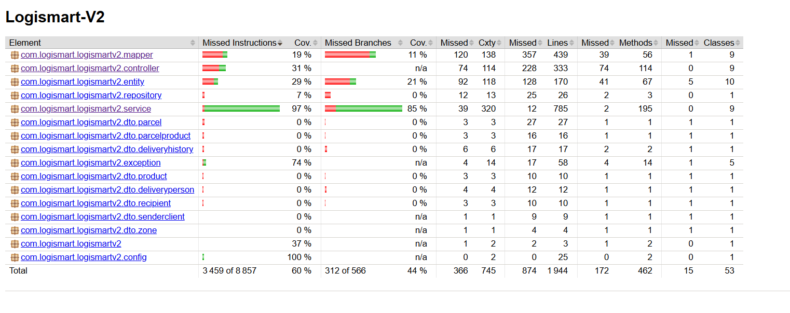
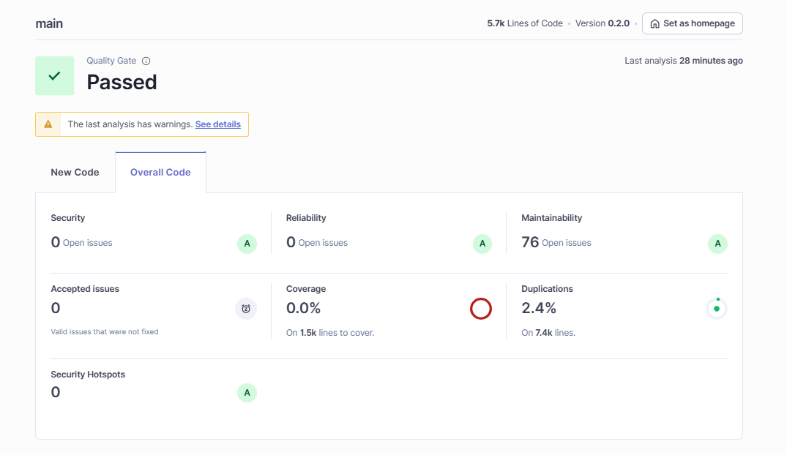

# SmartLogi Delivery Management System (SDMS)


> **Current Branch:** `testing`
> **Version:** 0.1.1
> **Status:** Active Development - Testing & Quality Assurance Phase

## Table of Contents
- [Overview](#overview)
- [Test Coverage](#test-coverage)
- [Technology Stack](#technology-stack)

## Overview

SmartLogi is a comprehensive logistics platform that manages the entire delivery lifecycle:
- **Parcel Management**: Create, track, and manage parcels from creation to delivery
- **Client Management**: Handle sender clients and recipients
- **Delivery Personnel**: Manage delivery staff and their assignments
- **Zone Management**: Organize deliveries by geographic zones
- **Product Tracking**: Track products within parcels
- **Delivery History**: Complete audit trail of parcel status changes
- **Statistics & Analytics**: Real-time insights into delivery operations

### Key Features
- RESTful API with OpenAPI/Swagger documentation
- Comprehensive validation and error handling
- Multi-layered architecture (Controller -> Service -> Repository)
- DTO pattern for clean separation of concerns
- MapStruct for efficient entity-DTO mapping
- Liquibase for database version control
- Extensive unit and integration testing

## Test Coverage

### Overall Coverage (JaCoCo Report)
- **Instruction Coverage:** 60% (5,398 / 8,857 instructions)
- **Branch Coverage:** 44% (254 / 566 branches)
- **Line Coverage:** 55% (1,070 / 1,944 lines)
- **Method Coverage:** 63% (290 / 462 methods)
- **Class Coverage:** 72% (38 / 53 classes)



*JaCoCo test coverage analysis showing 60% overall instruction coverage*

### Coverage by Layer

| Layer | Coverage | Status | Details |
|-------|----------|--------|---------|
| **Service Layer** | 97% | [EXCELLENT] | 785/797 lines, 213/250 branches |
| **Exception Handling** | 74% | [GOOD] | 41/58 lines covered |
| **Controller Layer** | 31% | [MODERATE] | 105/333 lines covered |
| **Entity Layer** | 29% | [MODERATE] | 42/170 lines covered |
| **Mapper Layer** | 19% | [LOW] | 82/439 lines covered |
| **Configuration** | 100% | [PERFECT] | 25/25 lines covered |

### Test Suite Statistics
- **Total Tests:** 260
- **Passed:** 260 [PASS]
- **Failed:** 0
- **Skipped:** 0
- **Execution Time:** ~37 seconds

### Test Distribution
**Service Tests (9 test classes - 153 tests):**
- `ParcelServiceTest`
- `DeliveryPersonServiceTest`
- `DeliveryHistoryServiceTest`
- `ProductServiceTest`
- `RecipientServiceTest`
- `SenderClientServiceTest`
- `ZoneServiceTest`
- `ParcelProductServiceTest`
- `StatisticsServiceTest`

**Controller Tests (3 test classes - 35 tests):**
- `DeliveryHistoryControllerTest`
- `ProductControllerTest`
- `ZoneControllerTest`

**Integration Tests (2 test classes - 72 tests):**
- `ParcelControllerIntegrationTest`
- `ZoneControllerIntegrationTest`

## Technology Stack

### Core Framework
- **Java:** 17 (LTS)
- **Spring Boot:** 3.3.5
- **Maven:** Multi-module build system

### Database & Persistence
- **Database:** PostgreSQL
- **ORM:** Spring Data JPA / Hibernate
- **Migration:** Liquibase
- **Test Database:** H2 (in-memory)

### API & Documentation
- **API Style:** RESTful
- **Documentation:** Springdoc OpenAPI 3 (Swagger UI)
- **API Spec:** OpenAPI 3.0

### Mapping & Validation
- **Object Mapping:** MapStruct 1.5.5
- **Validation:** Jakarta Validation (Bean Validation)
- **Utilities:** Lombok (reduces boilerplate)

### Testing
- **Framework:** JUnit 5
- **Mocking:** Mockito
- **Integration Testing:** Spring Boot Test with MockMvc
- **Coverage:** JaCoCo
- **Code Quality:** SonarQube ready

## Code Quality & SonarQube Analysis



*SonarQube code quality analysis showing comprehensive metrics for code health, maintainability, and technical debt*

### Running SonarQube Analysis
```bash
# Start SonarQube server on localhost:9000, then run:
mvn clean verify sonar:sonar
```
